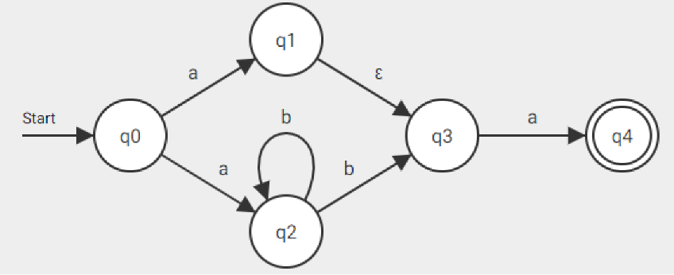

# Automaten, Sprachen und Compiler

Dieses Projekt umfasst das Grundgerüst für die Praktikumsaufgaben, welche Sie im Rahmen des Moduls Automaten, Sprachen
und Compiler (INF2201) bestehen müssen, um für die Klausur zugelassen zu werden. Das Projekt gibt einen Großteil der
benötigten Datenstrukturen bereits vor, die konkreten Implementierungen einiger der in der Vorlesung behandelten Algorithmen
bleibt jedoch Ihnen überlassen.

## Setup

Für die Arbeit mit diesem Projekt wird die Verwendung von [IntelliJ](https://www.jetbrains.com/de-de/idea/download/) empfohlen.
Die folgenden Schritte beschreiben, wie das Projekt aufgesetzt werden kann. Das Projekt benötigt Java 21.

1. Laden Sie dieses Projekt aus dem Moodlekurs herunter (bereits geschehen).
2. Öffnen Sie das Projekt in IntelliJ (File → Open). Das Projekt sollte automatisch erkannt und die benötigte Java-Version installiert werden.
3. Öffnen Sie die Main-Datei des Projekts (`src/main/java/de/thm/asc/Main`).
4. Klicken Sie auf das grüne Dreieck links neben der Hauptmethode und anschließend auf `Run 'Main.main()'`, um das Programm auszuführen.

## Endliche Automaten

Dieses Projekt verfügt über Strukturen für die Abbildung von endlichen Automaten. Im Laufe des Semesters werden Grammatiken und reguläre Ausdrücke dazukommen. 
Konkret können sie in einer jeweiligen formalen Sprache beschrieben und für die weitere Verarbeitung eingelesen werden. Machen Sie sich auch mit den
Methoden der jeweiligen Datenstrukturen vertraut!

Für endliche Automaten sind insbesondere folgende Klassen relevant:
- `AutomatonParser.java`: Erlaubt das Parsen einer Automatenbeschreibung.
- `FiniteAutomaton.java`: Interne Datenstruktur für endliche Automaten. Beachten Sie auch die Klassen `State`, `Symbol` und `Transition`.
- `FiniteAutomatonBuilder.java`: Hilfsklasse um endliche Automaten aufzubauen. Nützlich, da `FiniteAutomaton` selbst immutabel ist.

### Beschreibungssprache für Automaten

Das folgende Beispiel beschreibt die Definitionssprache für Automaten. Der Automat ist derselbe wie in Aufgabe 2 von
Übungsblatt 2 und erkennt Wörter wie `aa`, `aba` und `abba`.

Zustandsübergänge werden in der Form `a -> b: c`
beschrieben, wobei es sich bei `c` entweder um ein einzelnes Symbol oder um Epsilon (`ε`) handeln kann. Einfachheitshalber
können Epsilon-Übergänge auch durch Auslassen von `c` beschrieben werden. `A -> B: ε` und `A -> B:` sind demnach gleichbedeutend.

Der Startzustand muss mindestens einmal von **eckigen Klammern** umgeben sein. Im Beispiel geschieht dies in Zeile 1. Weitere
Verwendungen von `q0` können – müssen aber nicht – von eckigen Klammern umgeben sein.

Selbiges gilt für Endzustände. Sämtliche Endzustände müssen mindestens in einem Übergang durch **runde Klammern** gekennzeichnet sein.

```
[q0] -> q1: a
q0 -> q2: a
q2 -> q2: b
q2 -> q3: b
q1 -> q3: ε
q3 -> (q4): a
```



#### Beispielhafte Main-Methode zum Einlesen eines Automaten

`input.txt` muss sich im Wurzelverzeichnis des Projekts befinden.

```java
public static void main(String[] args) throws IOException {
    var automaton = AutomatonParser.parseFile("input.txt");
}
```

### Grafische Darstellung von Automaten

Um die generierten Automaten besser nachvollziehen zu können, verfügen Instanzen von `FiniteAutomaton` über die Methode
`toDotCode`, welche den Automaten in Form von DOT-Code zurückgibt, der mithilfe von [GraphViz](https://graphviz.org/) grafisch dargestellt werden
kann. Empfehlenswert ist die Verwendung eines Online-Renders, wie [diesem](https://dreampuf.github.io/GraphvizOnline).